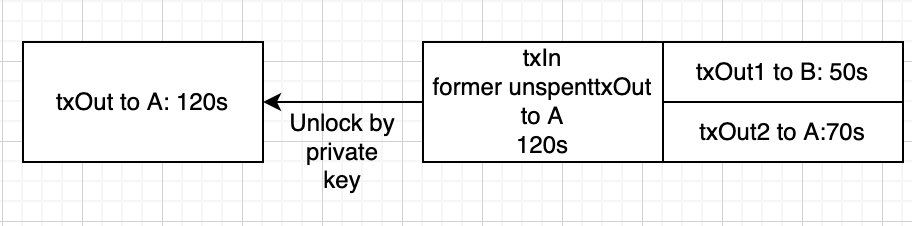
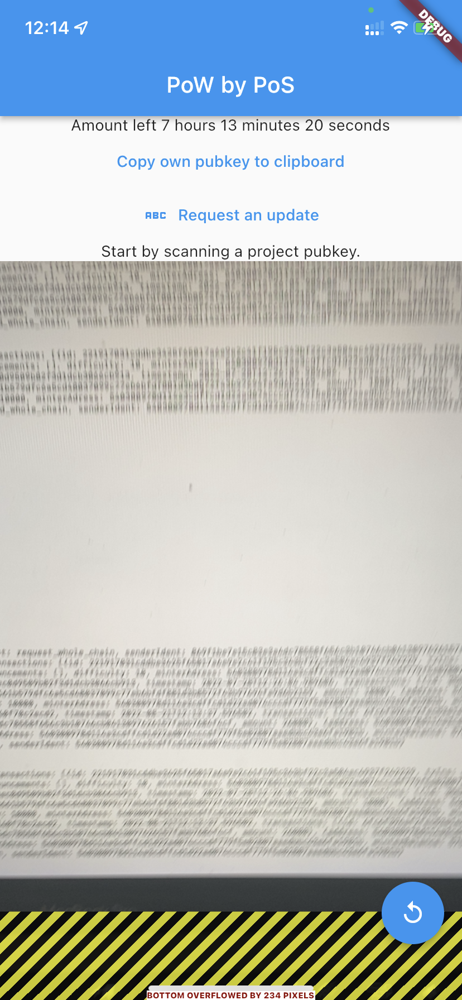
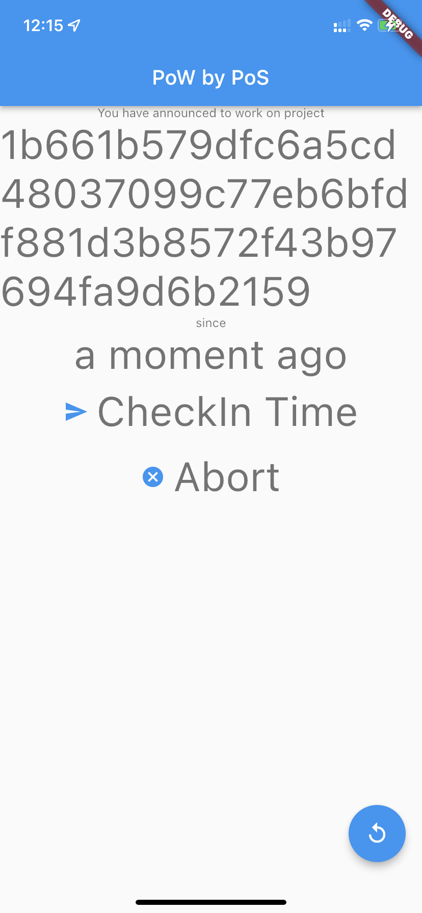
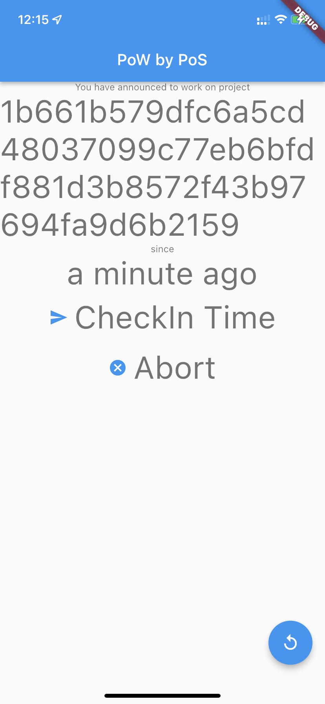
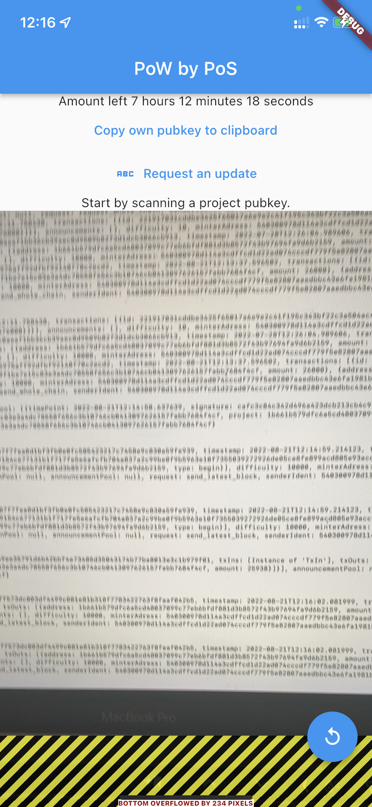

# proof-of-work-by-stake

[ReadMe of staking_lib](staking_lib/README.md)

[ReadMe of UI/iOS-App](flutter_app/README.md)

## Tutorial

### Step 0: Get git,flutter and dart

This heavily depends on your platform, please look at [the official Installation guide for Flutter](https://docs.flutter.dev/get-started/install).

Afterwards running a command like `dart --version` in terminal or cmd should print 
something sane like 

```bash
$ dart --version
Dart SDK version: 2.17.1 (stable) (Tue May 17 17:58:21 2022 +0000) on "macos_x64"
```

In order to download the source code, install git on your platform. (although this is not mandatory)

### Step 1: Get the source code

Download the source code by either command or the zip option under the green code button.
If you download as a zip you have to unpack it somewhere meaningful.
```bash
$ cd some/good/place/for/the/project
$ git clone https://github.com/henrixapp/proof-of-work-by-stake.git
```

### Step 1: Install dependencies of the project

Change into the directory `staking_lib` of the project:
```bash
$ cd proof-of-work-by-stake/staking_lib
```

Now get the packages that are needed for our project with `dart pub get`:

The output should look like this:
```bash
$ dart pub get
...
Got dependencies!
```
Afterwards you should be ready to run the programs.

### Step 2: Generate a public/private key pair as Account

Our signing in the blockchain is based on Ed25519 Elliptic Curve.
In order to sign transactions later on we need to generate at least two key-pairs.

While still being in the `staking_lib` folder execute the first program
`create_account.dart`. Invoke it with as many usernames as you like. It will 
generate for each a valid private/public key pair and store it in the folder as .json.
Furthermore a png is generated for each public key. For better usage with the app.

**Example:** Lets create an account `henrixapp`and `project-a`

```bash
$ dart create_account.dart henrixapp project-a
```

The files will be automatically generated and look like this:
```json
{"username":"henrixapp","pubKeyHEX":"540300978d114a3cdffcd1d22ad074cccdf779f5e82807aaedbbc43e6fa1981b","privateKeyHEX":"6a539c310badcfae4e4f5c8d6126a0d2dfc5dcff6b447f963d000cae47492e95","type":"user"}
```

In a reallife scenario, you would never share the privateKey(HEX) field.

this is why we generate a QR-code with the public key to share.
And this `henrixapp-pub.png` looks like this:


You can scan it with your phone and it should read `5403...`

**Background** The username is not stored in the chain, but simply for us to 
identify a key pair.

### Step 3: Generate a chain.

Now it is time to generate our first chain. To initiate a chain call the program
`client.dart` with a name of a chain, that does not exist (yet).

For example 
`dart client.dart henrixapp coolchain` generates the chain `coolchain` and stores
it in `coolchain.json`. As you will see you will automatically get an initial endowment
of `576000=4 * 5 * 8 * 3600` seconds (or a 40 hour work month).

```bash
$ dart client.dart henrixapp coolchain 
Validate:
true
Command(quit,send,balance):
```
Now enter `balance` and afterwards `quit`:

```
balance
Your balance is 576000
Command(quit,send,balance):
quit
```

**What is happening in the background?** Now a new file called `coolchain.json`
is generated. It looks like this:

```json
{"chain":[{"index":0,"previousHash":"","timestamp":"2022-07-28T12:12:11.758438","transactions":[{"id":"221917031cddbe3425f65017a6e9e2c41f195c343bf22c3a504ac4937f242229","txIns":[],"txOuts":[{"address":"540300978d114a3cdffcd1d22ad074cccdf779f5e82807aaedbbc43e6fa1981b","amount":576000}]}],"announcements":[],"difficulty":10,"minterAdress":"540300978d114a3cdffcd1d22ad074cccdf779f5e82807aaedbbc43e6fa1981b","minterBalance":100,"nonce":0}]}
```

It contains only a socalled *genesis block* with one transaction.

Now is a good time to understand the blockchains approach to transactions.

A normal transaction consists out of two parts `txIns`and `txOuts`. In a normal 
transaction the input amount must equal the output amount. The `txIns`
are references to former `txOuts`and  `txOuts`are so to say unspent on the chain until
they get referenced in a `txIn`. To get your balance, you just have to sum up all unspent txOuts.

The *genesis* block of our chain is special because it only contains one `txOut`
to our previously generated address (`540300978d114a3cdffcd1d22ad074cccdf779f5e82807aaedbbc43e6fa1981b`).
Furthermore, it does not contain reference to a previous hash as it is the starting block.


### Step 4: Send time to a different address

Now we can send some seconds to our second generated address. Simply start the client
again and this time send to a different address (in this example `1b661b...`):

```bash
$ dart client.dart henrixapp coolchain
Validate:
true
Command(quit,send,balance):
send
Please specify the address:
1b661b579dfc6a5cd48037099c77eb6bfdf881d3b8572f43b97694fa9d6b2159
Please enter the amount:
1000
Iters: 1
Command(quit,send,balance):
quit
```

Now have a look at the chain in `coolchain.json`:

```json
{"chain":[{"index":0,"previousHash":"","timestamp":"2022-07-28T12:12:11.758438","transactions":[{"id":"221917031cddbe3425f65017a6e9e2c41f195c343bf22c3a504ac4937f242229","txIns":[],"txOuts":[{"address":"540300978d114a3cdffcd1d22ad074cccdf779f5e82807aaedbbc43e6fa1981b","amount":576000}]}],"announcements":[],"difficulty":10,"minterAdress":"540300978d114a3cdffcd1d22ad074cccdf779f5e82807aaedbbc43e6fa1981b","minterBalance":100,"nonce":0},{"index":1,"previousHash":"30b4ac071144305c2f73bc0aeaf1bb36cb39aec0d9509b82f3d1dcb3066cb913","timestamp":"2022-07-28T12:26:04.989606","transactions":[{"id":"35b69a1bdf3a0a35aa90faffe89393a861c4aca77f58da2f3bf783d07ad5047c","txIns":[{"txOutId":"221917031cddbe3425f65017a6e9e2c41f195c343bf22c3a504ac4937f242229","txOutIndex":0,"signature":"10aec656a0a31d6c0e722156fa077541d91b6dbae27afd60aa88b456260a5a3d977c1571e5a24a8a3d5d73df52fece901265be0afd8116c3900b503a8fbb9e04"}],"txOuts":[{"address":"1b661b579dfc6a5cd48037099c77eb6bfdf881d3b8572f43b97694fa9d6b2159","amount":1000},{"address":"540300978d114a3cdffcd1d22ad074cccdf779f5e82807aaedbbc43e6fa1981b","amount":575000}]}],"announcements":[],"difficulty":10000,"minterAdress":"540300978d114a3cdffcd1d22ad074cccdf779f5e82807aaedbbc43e6fa1981b","minterBalance":576000,"nonce":5593}]}
```

There is still the genesis block and now there is a second block. Let's look at it in detail:

```json
{"index":1,"previousHash":"30b4ac071144305c2f73bc0aeaf1bb36cb39aec0d9509b82f3d1dcb3066cb913","timestamp":"2022-07-28T12:26:04.989606","transactions":[{"id":"35b69a1bdf3a0a35aa90faffe89393a861c4aca77f58da2f3bf783d07ad5047c","txIns":[{"txOutId":"221917031cddbe3425f65017a6e9e2c41f195c343bf22c3a504ac4937f242229","txOutIndex":0,"signature":"10aec656a0a31d6c0e722156fa077541d91b6dbae27afd60aa88b456260a5a3d977c1571e5a24a8a3d5d73df52fece901265be0afd8116c3900b503a8fbb9e04"}],"txOuts":[{"address":"1b661b579dfc6a5cd48037099c77eb6bfdf881d3b8572f43b97694fa9d6b2159","amount":1000},{"address":"540300978d114a3cdffcd1d22ad074cccdf779f5e82807aaedbbc43e6fa1981b","amount":575000}]}],"announcements":[],"difficulty":10000,"minterAdress":"540300978d114a3cdffcd1d22ad074cccdf779f5e82807aaedbbc43e6fa1981b","minterBalance":576000,"nonce":5593}]
```

First of all it contains a previous hash and a timestamp. It also contains one transaction.
In that the `txIn` is referencing  the previous transaction (starting with `221917`) from the genesis block
and its 0 (so first) txOut.
This `txIn`has to be signed so that we know that the owner of the address is actually fine 
with spending their `txOut`. the `txOut`consists out of two entries. One for the amount we
are sending to the address we entered and one containing the rest of the unspent `txOut`
we were using.

| Illustration of the txOut/txIn mechanism |
| ---------------------------------------- |
|  |

Furthermore, it contains information about the minter  and the difficulty we assigned for finding the block and the nonce we used for finding the block more quickly.
 The difficulty is used to satisfy the staking condition:

```
 SHA256 < 2^{256}*(balance/{difficulty)
```

Now you can check with the second keyfile, whether the amount arrived in their wallet:

```bash
dart client.dart project-a coolchain
Validate:
true
Command(quit,send,balance):
balance
Your balance is 1000
Command(quit,send,balance):
quit
```

### Step 5: Get the app working

To run the app, open a second terminal and change into flutter_app.
Make sure, that your phone is connected and stays the whole time.

```
$ flutter run
```

Now the app should start on your phone. It will ask you for camera permissions,
as it is easier to scan than to type in long public keys.
The app automatically generates a keypair.
You can extract it by coping it to the clipboard.

Send this publickey to your pc and try to send some time to it (like in step 4).

In order to transmit the `coolchain` to your phone, your computer and phone have 
to be on the same network. Now start in the first terminal the `node.dart`script:

It is important that you give 65000 as second argument to the program.
`65000`is the  UDP port used to broadcast changes to the network & phone.
```bash
$ dart node.dart henrixapp 65000 coolchain
true
65000
65000
Validate:
```

Afterwards, you should press the request button in the app and the amount should 
update to that what you have transferred first.
In the flutter run log should be a message like 

```
Updated chain. From 540300978d114a3cdffcd1d22ad074cccdf779f5e82807aaedbbc43e6fa1981b.
```

|  After request update   |
| ------------------------ |
|  |

### Step 6 Using the app

Until now, we did not use the annoucement feature of our blockchain.
If you scan a qr code, like the one earlier, you will automatically announce in the chain,
that you are working on the project under that adress and will later transfer time 
to it.

|  Announcement directly   | ... after one minute    |
| ------------------------ | ----------------------- |
|  |  |

Go ahead and scan the qr code of henrixapp-pub.png for example. Wait for a minute and then "Checkin time" to ammend the chain.


|  Updated time after transaction to `project-a`   |
| ------------------------ |
| |

The node should automatically store these transaction in `coolchain.json`

**Note** you can try to send time to any qr code, but the balance will be lost,
if the qr code is no valid public key or you do not have the valid private key.